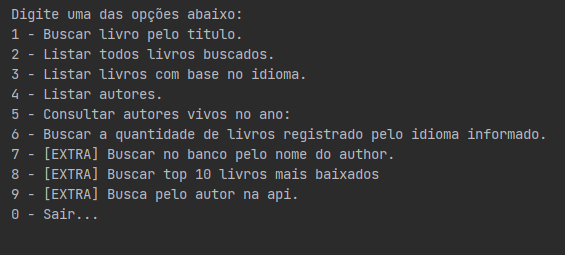
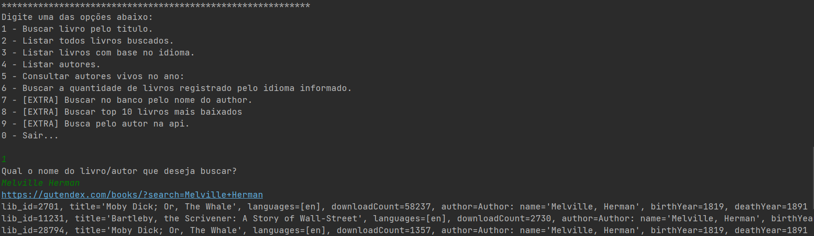
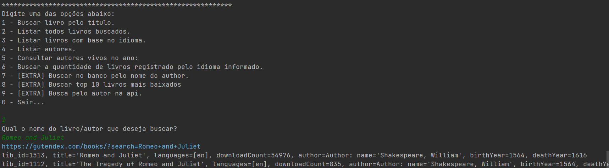
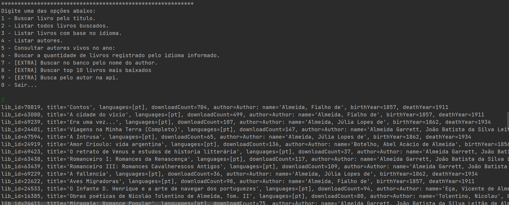

## 🔨 Funcionalidades do projeto

- `Menu`: Menu interativo para usuário.

- `Consulta API Gutendex`: A aplicação se conecta à API da Gutendex e consulta o livro/autor que usuário informa.
  
- `Persistência dos dados`: Ao consultar a API da Gutendex e receber informações sobre livros e autores, a aplicação realiza a persistência desses dados em um banco de dados Postgres. Isso permite consultas posteriores ao histórico dos livros e autores consultados.

----

### **Exemplos**: 

Buscando livros por autor:

Buscando pelo livro:

Listando todos livros buscados:

